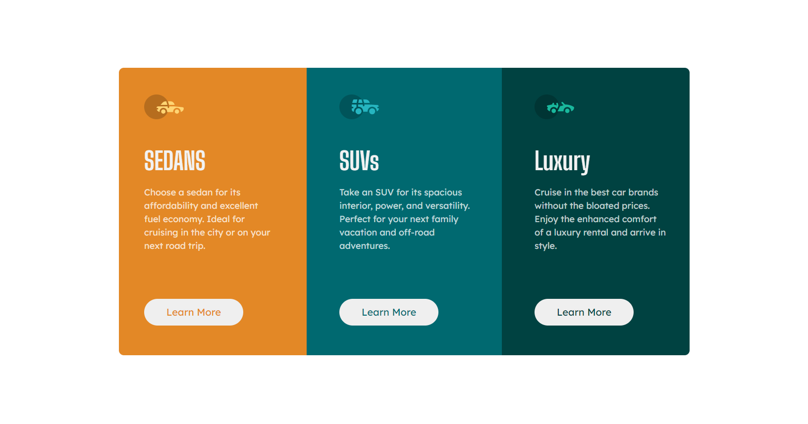

# Frontend Mentor - 3-column preview card component

This is a solution to the [3-column preview card component challenge on Frontend Mentor](https://www.frontendmentor.io/challenges/3column-preview-card-component-pH92eAR2-). Frontend Mentor challenges help you improve your coding skills by building realistic projects. 

## Table of contents

- [Overview](#overview)
  - [Screenshot](#screenshot)
  - [Links](#links)
- [Author](#author)

## Overview
This is my first Frontend Mentor project. A simple card component which contain a QR Code, title and a description. I have used HTML5 and CSS3 to build this project and used SASS to create CSS files.

### Screenshot

### Links

- Solution URL: [https://www.frontendmentor.io/solutions/responsive-page-using-css-grid-oF4PXBRht2](https://www.frontendmentor.io/solutions/responsive-page-using-css-grid-oF4PXBRht2)
- Live Site URL: [https://siddhinandaniya.github.io/3-column-preview-card-component/](https://siddhinandaniya.github.io/3-column-preview-card-component/)

## Author

- Linkedin - [Siddhi Nandaniya](https://www.linkedin.com/in/siddhi-nandaniya/)
- Frontend Mentor - [@siddhinandaniya](https://www.frontendmentor.io/profile/Siddhinandaniya)
